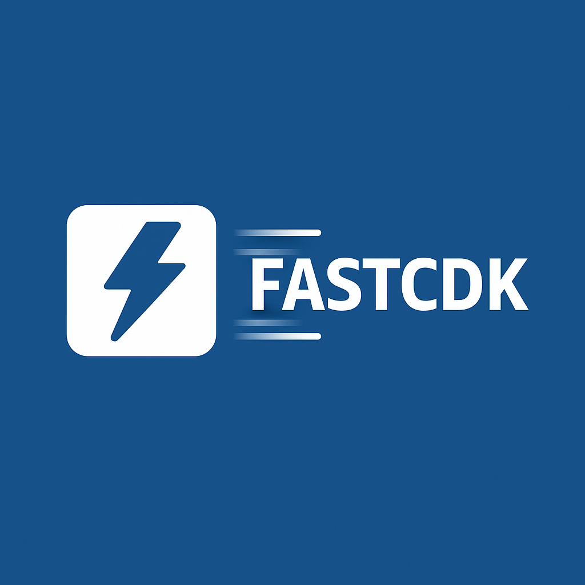

# FastCDK VS Code Extension

<p align="center">
  
</p>

### Syntax highlighting • IntelliSense • Quick diagnostics for the **FastCDK Domain Specific Language**

This extension brings first-class editor support for
**[FastCDK](https://github.com/lazarmarkovic/fast-cdk)** ---\
a Domain Specific Language for generating TypeScript-based AWS CDK
infrastructure projects.


## What is FastCDK?

**FastCDK** is an extensible DSL for rapid AWS CDK project generation.\
It combines reusable *Definition* templates with *Stack Instance*
specifications to automatically synthesize entire AWS CDK projects ---
with dependency graphing, templating, and protected code regions for
safe regeneration.

### 🔧 DSL overview

FastCDK projects use: 
1. **Definitions** (`.fcdk_def`, `.j2`) ---
describe reusable AWS CDK constructs and templates\
2. **Instances** (`.fcdk`) --- define real stacks using those constructs

The CLI compiles instances into CDK projects through semantic graph
traversal and Jinja2 rendering.

## Installation

### Option 1 --- From `.vsix`

Package it locally and install:

``` bash
npm run build
vsce package
code --install-extension fast-cdk-vscode-0.1.0.vsix
```

> Restart VS Code after installation to ensure the language is loaded.

## License

MIT License © 2025 Lazar M. Marković